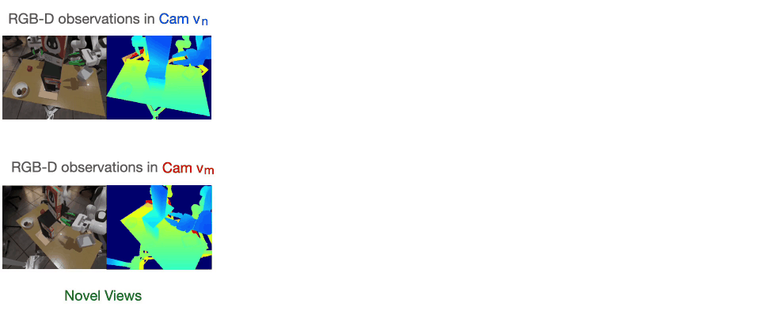
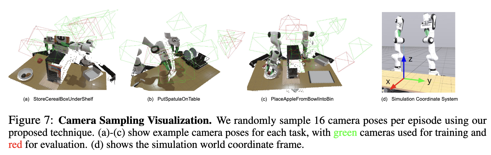
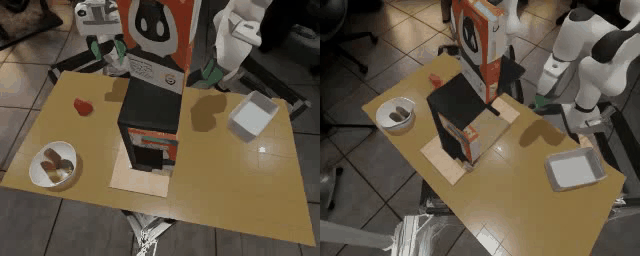
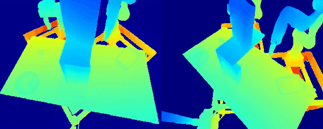
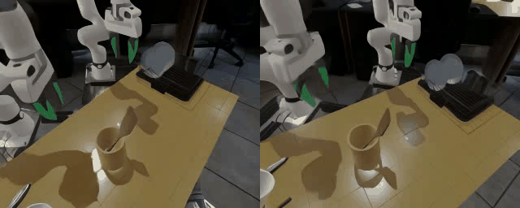
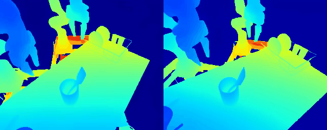
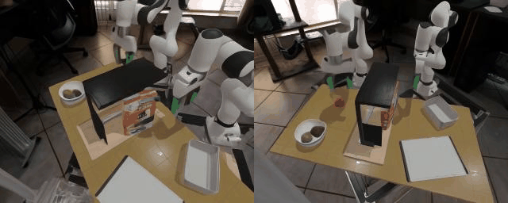
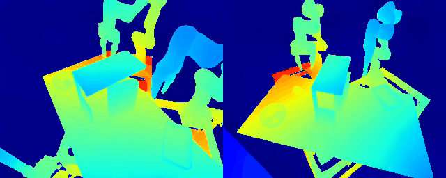

# 🧠 Geometry-aware 4D Video Generation for Robot Manipulation


<p align="center">
  
</p>

We propose a **4D video generation model** that enforces geometric consistency across multiple camera views to predict spatio-temporally aligned RGB-D videos from a single RGB-D image per view. We further demonstrate applications to robot manipulation by extracting gripper poses from generated videos using an off-the-shelf pose tracking algorithm. We show that the model generalizes to novel viewpoints and enables robots to leverage multi-view information for planning.

<p align="center">
  
</p>

---

## 🔗 Project Links

|                  📄 Paper                 |              🌐 Project Page             |                     📦 Dataset                     |                                                     🤗 Hugging Face                                                    |
| :---------------------------------------: | :--------------------------------------: | :------------------------------------------------: | :--------------------------------------------------------------------------------------------------------------------: |
| [arXiv](https://arxiv.org/abs/2507.01099) | [Website](https://robot4dgen.github.io/) | [Stanford Mirror](https://real.stanford.edu/4dgen) | [Dataset](https://huggingface.co/datasets/Zeyi/4dgen-dataset) · [Checkpoints](https://huggingface.co/Zeyi/4dgen-ckpts) |

---

## 👥 Authors

[Zeyi Liu](http://lzylucy.github.io/)¹ ·
[Shuang Li](https://shuangli59.github.io/)¹ ·
[Eric Cousineau](https://www.eacousineau.com/)² ·
[Siyuan Feng](https://www.cs.cmu.edu/~sfeng/)² ·
[Benjamin Burchfiel](https://www.tri.global/about-us/dr-ben-burchfiel)² ·
[Shuran Song](https://shurans.github.io/)¹

¹ Stanford University  
² Toyota Research Institute

---

## 🧩 Overview

Robotic manipulation requires understanding **how 3D geometry evolves over time** under agent actions. However, most video generation models are trained with single-view RGB videos, limiting their ability to reason about geometry and cross-view consistency.

This project introduces a **geometry-aware 4D video generation pipeline** that:

* Models **multi-view RGB-D observations** across time
* Enforces **cross-view geometric consistency** via pointmaps
* Learns temporally coherent latent dynamics suitable for manipulation

The resulting models serve as strong foundations for **world modeling, policy learning, and planning** in robotics.

---

## 📦 Dataset

<p align="center">
  
</p>

We release a **multi-view, multi-task robotic manipulation dataset** collected in simulation.

### Tasks

* StoreCerealBoxUnderShelf
* PutSpatulaOnTableFromUtensilCrock
* PlaceAppleFromBowlIntoBin

### Key Properties

* **50 demonstrations per task**
* **16 RGB-D camera views per timestep**, sampled from the upper hemisphere
* **Synchronized robot actions and observations**
* Simulated in the **Large Behavior Model (LBM)** environment

📥 Download links:

* Dataset: [https://real.stanford.edu/4dgen/data/](https://real.stanford.edu/4dgen/data/)
* Hugging Face mirror: [https://huggingface.co/datasets/Zeyi/4dgen-dataset](https://huggingface.co/datasets/Zeyi/4dgen-dataset)

---

## 🧠 Pre-trained Models

We provide multiple checkpoints to support different stages of the pipeline:

* **Stable Video Diffusion (SVD)** backbones
* **Task-specific VAEs** for RGB and pointmap latents
* **4D video generation models** fine-tuned on manipulation data

📦 Checkpoints:

* SVD / base models: [https://real.stanford.edu/4dgen/checkpoints/](https://real.stanford.edu/4dgen/checkpoints/)
* Fine-tuned VAEs: [https://real.stanford.edu/4dgen/checkpoints/VAE/](https://real.stanford.edu/4dgen/checkpoints/VAE/)
* 4D generation outputs: [https://real.stanford.edu/4dgen/checkpoints/outputs/](https://real.stanford.edu/4dgen/checkpoints/outputs/)

---

## ⚙️ Installation

We recommend using **conda or mamba**.

```bash
cd 4dgen
conda env create -f environment.yml
conda activate video_policy
conda install pytorch3d
```

**Tested on:**

* Ubuntu 22.04
* CUDA 12.2

---

## 🔧 Training

### 1️⃣ Fine-tune the VAE

```bash
CUDA_VISIBLE_DEVICES=<GPU_IDS> \
HYDRA_FULL_ERROR=1 \
python scripts/train.py --config-name=finetune_autoencoder_workspace
```

### 2️⃣ Train the 4D Video Generation Model

```bash
CUDA_VISIBLE_DEVICES=<GPU_IDS> \
HYDRA_FULL_ERROR=1 \
python scripts/train.py --config-name=finetune_svd_lightning_workspace
```

**Notes:**

* Tested on **4× NVIDIA A6000 (48GB)**
* Batch size: 1
* Training time: ~2 days

---

## 🔍 Inference

Run the provided evaluation example:

```bash
python notebooks/eval.py
```

This script demonstrates loading a trained checkpoint and generating multi-view 4D predictions.


## 🎥 Qualitative Results

We show representative qualitative results illustrating multi-view RGB-D video generation.

### Generated RGB-D Videos

#### Task 1
<p align="center">
  
  
</p>

#### Task 2
<p align="center">
  
  
</p>

#### Task 3
<p align="center">
  
  
</p>


## 📚 Citation

If you find this project useful, please consider citing:

```bibtex
@article{liu2025geometry,
  title={Geometry-aware 4D Video Generation for Robot Manipulation},
  author={Liu, Zeyi and Li, Shuang and Cousineau, Eric and Feng, Siyuan and Burchfiel, Benjamin and Song, Shuran},
  journal={arXiv preprint arXiv:2507.01099},
  year={2025}
}
```

---

## 📄 License

This project is released for **research use**. Please see the repository for license details.

---

💬 **Questions or issues?** Feel free to open a GitHub issue or reach out via the project page.
